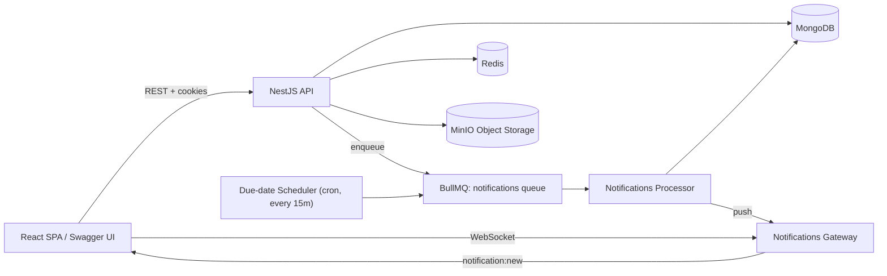

<div align="center">

# TaskFlow — Backend

**A production-grade, self-hosted project & task management API — the engine behind [TaskFlow](https://github.com/AnarDevJourney/taskflow-frontend).**

Built with NestJS, MongoDB, Redis and MinIO. Streaming file uploads, a queue-backed real-time notification pipeline, and analytics computed entirely in MongoDB aggregation pipelines — not in application code.

[](https://nestjs.com/)
[](https://www.typescriptlang.org/)
[](https://www.mongodb.com/)
[](https://redis.io/)
[](https://www.docker.com/)
[](https://socket.io/)

[Frontend repository →](https://github.com/AnarDevJourney/taskflow-frontend)

</div>

---

## Table of Contents

- [What is this?](#what-is-this)
- [Feature Overview](#feature-overview)
- [Tech Stack](#tech-stack)
- [Architecture](#architecture)
- [Engineering Deep Dives](#engineering-deep-dives)
  - [Notification Pipeline](#1-notification-pipeline-queue-backed-not-request-blocking)
  - [Streaming File Uploads](#2-streaming-file-uploads-zero-buffering)
  - [Dashboard Analytics](#3-dashboard-analytics-aggregation-only-no-js-computation)
  - [Rate Limiting](#4-rate-limiting)
- [Security](#security)
- [Performance Notes](#performance-notes)
- [API Overview](#api-overview)
- [Roles & Permissions](#roles--permissions)
- [Project Structure](#project-structure)
- [Getting Started](#getting-started)
- [Environment Variables](#environment-variables)
- [Project Status](#project-status)
- [Author](#author)

---

## What is this?

TaskFlow is a Jira/Linear-style team & project management platform, built end-to-end
from scratch as a demonstration of production-level backend engineering — not a CRUD
tutorial project. This repository is the **API server**: a NestJS application exposing
a REST API (JWT/cookie authentication) and a WebSocket gateway for real-time updates,
backed by MongoDB, Redis/BullMQ, and MinIO.

The companion [frontend](https://github.com/AnarDevJourney/taskflow-frontend) is a
React 19 SPA that consumes this API — the two are independently deployable services.

---

## Feature Overview

**Task Management**
- Full CRUD with title, description, status, priority, assignee, due date, labels, story points
- Drag-and-drop kanban reordering (cross-column and same-column)
- Bulk operations (status, priority, assignee, labels)
- Checklists, task-to-task links, watchers, file attachments
- Cross-project "My Tasks" view backed by a single indexed query, not a project fan-out

**Workspaces & Projects**
- Workspace-level organization with role-based access control (Owner/Admin/Member/Viewer/Guest)
- Free-form, per-project kanban columns — no hardcoded status enum
- Member management with per-workspace role overrides
- Soft-delete (archive/restore) instead of destructive deletes

**Sprints**
- Sprint creation, start, and completion with configurable handling of incomplete tasks
- Velocity tracking and burndown-chart data, computed from real task history

**Collaboration**
- Threaded task comments with `@mention` support
- Real-time in-app notifications (WebSocket) + transactional email (assignment, due-date, mentions)
- Full, immutable activity/audit log — every mutation is recorded with actor, IP, browser, OS, device

**Files**
- Streaming multipart uploads straight to MinIO (S3-compatible object storage) — no disk or memory buffering
- Presigned, time-limited download URLs for private attachments; public URLs for avatars/logos

**Dashboard**
- One aggregation-driven endpoint powering 4 KPI cards, two distribution charts, a 7-day
  productivity trend, per-assignee workload, a 371-day activity heatmap, and sprint progress

**Search**
- Full-text search across tasks, projects, and members, with task-number lookup (e.g. `TF-42`)

**Auth**
- Invite-only registration (no open sign-up) — a real security posture for an internal tool
- JWT access (15 min) + refresh (7 days) tokens, delivered exclusively via HttpOnly cookies
- Forgot/reset password flow via email

---

## Tech Stack

| Layer               | Technology                                          |
| -------------------- | ---------------------------------------------------- |
| Framework            | NestJS (TypeScript, modular DI architecture)          |
| Database              | MongoDB + Mongoose, aggregation-pipeline-driven analytics |
| Cache / Queue          | Redis + BullMQ (background jobs, notification queue) |
| Real-time             | Socket.io (WebSocket gateway)                          |
| File storage          | MinIO (S3-compatible), streamed multipart uploads      |
| Auth                  | JWT + Passport, HttpOnly cookies                        |
| Email                 | Nodemailer + Handlebars templates                       |
| Validation            | class-validator + class-transformer                      |
| API docs              | Swagger / OpenAPI (dev-only)                              |
| Containerization       | Docker, multi-stage build, separate dev/prod Compose files |

---

## Architecture



Every feature lives in its own self-contained module: `schemas/ → dto/ → enums/ →
service → controller → module`. Controllers never contain business logic — they parse
the request and delegate; every permission check (`membership → role → operation`)
lives in the service layer, checked explicitly, never assumed from a guard alone.

```
src/
├── config/          # Joi-validated environment config, typed config service
├── database/        # Mongoose connection
├── common/
│   ├── guards/       # JwtAuthGuard, RolesGuard
│   ├── decorators/    # @CurrentUser, @Public, @Roles, @Throttle
│   ├── filters/        # Global HttpExceptionFilter → consistent error envelope
│   ├── interceptors/    # TransformInterceptor (response envelope), LoggingInterceptor
│   ├── middleware/       # RequestContextMiddleware — captures IP/UA per request (AsyncLocalStorage)
│   ├── storage/           # MinioService — the only code that talks to the SDK
│   └── upload/             # Streaming multer storage engine + interceptor + resolvers
└── modules/
    ├── auth/            # Invite-only login, register, refresh, password reset
    ├── users/           # User schema + avatar upload
    ├── workspaces/      # Workspace CRUD, membership, roles
    ├── projects/        # Project CRUD + free-form kanban columns
    ├── tasks/           # Task CRUD, bulk ops, filtering, my-tasks
    ├── comments/         # Comments + @mentions
    ├── sprints/          # Sprint planning, velocity, burndown
    ├── activity/          # Immutable audit log
    ├── notifications/      # BullMQ producer/worker + WebSocket gateway + email
    ├── files/               # Streaming MinIO upload, presigned download
    ├── search/               # Full-text search
    ├── table-settings/        # Per-user, per-table saved view/columns/page-size
    ├── sidebar-settings/       # Per-user saved sidebar layout
    └── dashboard/               # Read-only, aggregation-only reporting endpoint
```

---

## Engineering Deep Dives

These are the parts of this codebase that go beyond a standard CRUD API — the
decisions that separate "it works" from "it works correctly under load, restarts,
and failure."

### 1. Notification Pipeline (queue-backed, not request-blocking)

```
service call → NotificationsService.notify()   (enqueue only — no DB write, no socket call)
             → BullMQ "notifications" queue in Redis
             → NotificationsProcessor (worker, concurrency: 5)
             → NotificationsGateway → socket.io room "user:<id>"
```

- **Never blocks the request path.** Assigning a task or posting a comment returns
  immediately; the notification is created, persisted, and pushed asynchronously.
- **Idempotent by construction.** Jobs carry a `dedupeKey`; a unique partial index on
  `(recipientId, dedupeKey)` combined with `insertMany({ ordered: false })` makes
  re-delivery a safe no-op — which is what lets the due-date scanner re-run every 15
  minutes without ever double-notifying anyone.
- **Idempotent scheduling.** The due-date scan is registered as a BullMQ job
  *scheduler* (upserted on boot), so restarting the API can never spawn a duplicate cron.
- **Cookie-based WebSocket auth.** The gateway reads the `access_token` HttpOnly
  cookie straight off the socket handshake headers — there is no token to leak into
  client-side JS. On expiry the server disconnects the socket explicitly and the
  client refreshes + reconnects (bounded to 3 attempts).
- **Server is the single source of truth for the unread badge** — it is never
  incremented client-side, which is the only way it stays correct across multiple
  open tabs.

### 2. Streaming File Uploads (zero buffering)

Uploads never touch disk and are never fully buffered in memory. A custom Multer
`StorageEngine` pipes the multipart file stream directly into MinIO, chunk by chunk.

- **Measured, not assumed:** a 90 MB upload produces roughly 30 MB of peak RAM delta,
  returning to baseline immediately after — the memory footprint of a 1 MB and a
  1 GB upload is effectively identical.
- **The MinIO SDK's part size is pinned to 5 MB deliberately.** The SDK buffers an
  entire object in memory whenever its computed part size is ≥ the object size (its
  default part size is 64 MB) — pinning `partSize` forces the chunked path for every
  upload, no matter how small. This was found and fixed as a real bug, not a
  pre-emptive guess.
- **Rollback discipline:** upload failure → nothing is written to Mongo. Mongo write
  failure after a successful upload → the MinIO object is deleted to prevent an
  orphaned blob. Attachment deletion removes the object *before* the DB record, so a
  failure mid-delete leaves recoverable metadata rather than an unreferenced file.
- **Two separate MinIO clients**, on purpose: one for in-cluster reads/writes, one
  pinned to the public-facing URL purely for presigning downloads — a SigV4-signed
  URL covers the `Host` header, so a URL signed for the internal address is rejected
  by the browser.

### 3. Dashboard Analytics (aggregation-only, no JS computation)

The entire dashboard — 4 KPI cards, two distribution charts, a productivity trend,
per-assignee workload, a 371-day activity heatmap, sprint progress — is served by
**one** endpoint, computed by **three parallel MongoDB aggregation pipelines**
(`Promise.all`), never eight separate `countDocuments()` calls.

- **Every number comes from the same call**, so the KPI cards and charts can
  structurally never disagree with each other.
- **Nothing is computed in JavaScript** — percentages, zero-filling, bucketing, and
  the sprint-progress ratio are all aggregation expressions (`$switch`, `$facet`,
  a small hand-written expression library). This is an explicit constraint, not an
  accident: any statistic that migrates into JS quietly reintroduces the slow
  per-widget query pattern this module was built to avoid.
- **Index-driven, verified with `.explain()`** — a workspace-scoped activity index
  was added after `.explain()` showed an in-memory `SORT` stage; with the index in
  place the plan is `LIMIT ← FETCH ← IXSCAN`.
- **Timezone-correct day bucketing** — the productivity trend groups by the server's
  IANA timezone, not UTC, so the chart never disagrees with the KPI cards around
  midnight, and DST transitions can't shift a day into its neighbor.

### 4. Rate Limiting

A single global `ThrottlerGuard` (300 req/60s) protects every route by default.
Sensitive endpoints override the *same* throttler rather than registering a second
named one — registering a second named throttler applies it to every route in the
app, which is how a previous version of this project accidentally capped the entire
API at 10 requests/minute. That failure mode is now documented and tested for.

| Endpoint class                                  | Limit         | Reason                        |
| ------------------------------------------------ | -------------- | ------------------------------ |
| Default (all routes)                              | 300 / 60s      | Baseline protection            |
| `login` / `register` / `forgot-password` / `reset-password` | 10 / 60s | Brute-force & enumeration defense |
| File/avatar/logo uploads                            | 20 / 60min     | Expensive MinIO writes         |
| `GET /health`                                        | unlimited      | Docker healthcheck polls every 10s |

---

## Security

- **HttpOnly cookies only** — JWTs are never exposed to JavaScript, closing the
  standard XSS-token-theft vector outright.
- **Path-scoped refresh token** (`/auth/refresh`) — never sent on ordinary requests,
  reducing the token's exposure surface.
- **Fail-closed auth** — `JwtAuthGuard` is applied globally; routes are opt-out
  (`@Public()`), not opt-in, so a forgotten guard can never leave an endpoint open.
- **Defense in depth on authorization** — every service method still explicitly
  re-checks membership and role before acting, rather than trusting the guard alone.
- **Helmet** for standard HTTP header hardening (clickjacking, MIME sniffing, etc.).
- **Every request body is a typed, validated DTO** (`class-validator`) — length caps,
  enum constraints, and optionality are declared, never inferred.
- **Passwords hashed with bcrypt**, excluded from query results by default (`select: false`).
- **ObjectId validation at the boundary** (`toObjectId()`) — a malformed id is
  rejected with `400` before it ever reaches a MongoDB query.
- **Strict MIME-type allow-lists and size ceilings** on every upload path, enforced
  server-side (the client-side check is UX-only, never the real gate).
- **Swagger UI is disabled in production** entirely — one less discoverable surface.
- **Fail-fast configuration** — all environment variables are Joi-validated at boot;
  the app refuses to start on a missing or malformed variable, and refuses to start
  in production with a checked-in placeholder JWT secret or the default MinIO
  credentials.
- **Full audit trail** — every mutation logs actor, action, IP, browser, OS, and
  device, captured automatically via `AsyncLocalStorage` request context.

---

## Performance Notes

- Hand-picked compound MongoDB indexes matched to real query shapes (e.g.
  `{ workspaceId: 1, assigneeId: 1 }` for cross-project "My Tasks"), verified with
  `.explain()`, not assumed.
- Dashboard: 8 potential queries collapsed into 3 parallel aggregation pipelines.
- File uploads: constant memory usage regardless of file size (see [deep dive](#2-streaming-file-uploads-zero-buffering)).
- Background work (notification creation, email delivery) is fully decoupled from
  the request/response cycle — API latency never depends on it.
- BullMQ workers run at tuned concurrency (5) and are architected to be moved to a
  dedicated worker process with zero code changes.

---

## API Overview

All endpoints are prefixed with `/api/v1`. Every response uses a consistent envelope:

```jsonc
// Success
{ "success": true, "data": { /* ... */ } }

// Error
{ "success": false, "error": { "statusCode": 404, "message": "...", "path": "..." } }
```

| Module         | Base Path                                              |
| --------------- | --------------------------------------------------------|
| Auth             | `/auth`                                                  |
| Workspaces        | `/workspaces`                                            |
| Projects           | `/workspaces/:workspaceId/projects`                        |
| Tasks               | `/workspaces/:workspaceId/projects/:projectId/tasks`          |
| My Tasks             | `/workspaces/:workspaceId/my-tasks`                              |
| Comments               | `/workspaces/:workspaceId/projects/:projectId/tasks/:taskId/comments` |
| Sprints                  | `/workspaces/:workspaceId/projects/:projectId/sprints`                    |
| Activity Log               | `/workspaces/:workspaceId/activity`                                          |
| Notifications                 | `/notifications`                                                                  |
| Files                            | `/files`, `/users/me/avatar`, `/workspaces/:workspaceId/logo`                        |
| Search                              | `/search`                                                                                |
| Dashboard                              | `/workspaces/:workspaceId/dashboard/overview`                                              |
| Table / Sidebar Settings                  | `/table-settings/:key`, `/sidebar-settings`                                                   |

Full interactive documentation (Swagger UI) is available at **`/api/docs`** when
running in development mode.

---

## Roles & Permissions

| Role   | Scope     | Description                                                |
| ------ | --------- | ------------------------------------------------------------ |
| Owner  | Workspace | Full control — archive/restore workspace, manage all members and roles |
| Admin  | Workspace | Manage members, create projects, edit workspace settings         |
| Member | Workspace | Create and manage tasks, comment, join projects                     |
| Viewer | Workspace | Read-only access across all projects                                   |
| Guest  | Project   | Access limited to explicitly assigned projects only                       |

---

## Project Structure

See [Architecture](#architecture) above for the full module tree.

---

## Getting Started

### Prerequisites

- Docker & Docker Compose
- Node.js 20+ (only needed for running outside Docker)

### Run with Docker (recommended)

```bash
git clone https://github.com/AnarDevJourney/taskflow-backend.git
cd taskflow-backend
cp .env.docker.example .env.docker   # fill in real secrets — see below
./scripts/dev.sh                     # builds & starts api, mongo, redis, minio
```

`./scripts/dev.sh` starts all four containers detached and opens a new terminal
tailing the API's logs. Use `./scripts/prod.sh` for a production-style build (it
warns if any JWT secret is still a placeholder), and `./scripts/stop.sh` to stop
containers interactively.

Once running:
- API base URL: `http://localhost:3000/api/v1`
- Swagger docs (dev only): `http://localhost:3000/api/docs`

### Seeding data

```bash
docker exec -it taskflow-api-dev npm run seed:docker
```

### Run without Docker

```bash
npm install
cp .env.example .env    # point at a local Mongo/Redis/MinIO instance
npm run start:dev
```

---

## Environment Variables

All variables are validated at startup with Joi (`src/config/validation.schema.ts`) —
the app refuses to boot if a required variable is missing or malformed.

| Variable | Default | Purpose |
|---|---|---|
| `NODE_ENV` | `development` | `development` \| `production` \| `test` |
| `PORT` | `3000` | API port |
| `APP_URL` | `http://localhost:3000` | Public base URL |
| `CORS_ORIGINS` | `http://localhost:5173` | Allowed frontend origin(s) |
| `DATABASE_URI` | — | MongoDB connection string (required) |
| `REDIS_URL` | — | Redis connection string (required) |
| `JWT_SECRET` / `JWT_REFRESH_SECRET` | — | Min. 32 chars, must differ, no placeholders in production |
| `JWT_EXPIRES_IN` / `JWT_REFRESH_EXPIRES_IN` | `15m` / `7d` | Token lifetimes |
| `MINIO_ENDPOINT`, `MINIO_ACCESS_KEY`, `MINIO_SECRET_KEY` | — | Object storage credentials (required) |
| `MINIO_PART_SIZE_MB` | `5` | Multipart chunk size — load-bearing, not tuning (see deep dive) |
| `MINIO_PUBLIC_URL` | — | Browser-facing MinIO address, used for presigned URLs |
| `MAX_UPLOAD_MB` / `MAX_IMAGE_UPLOAD_MB` | `100` / `5` | Attachment / avatar size ceilings |
| `SMTP_HOST`, `SMTP_USER`, `SMTP_PASS`, `SMTP_FROM` | — | Transactional email (required) |
| `PRESIGNED_URL_EXPIRY` | `3600` | Download link lifetime, seconds |

Two separate env files are used and both are gitignored: `.env` for running outside
Docker (`localhost` hosts), `.env.docker` for Docker Compose (service-name hosts like
`mongo`, `redis`, `minio`).

---

## Project Status

Backend is feature-complete: auth, workspaces, projects, tasks, comments, sprints,
activity log, notifications (queue + WebSocket + email), streaming file uploads,
search, per-user table/sidebar preferences, and the aggregation-driven dashboard are
all implemented, dockerized, and documented. See the
[frontend repository](https://github.com/AnarDevJourney/taskflow-frontend) for the
React client that consumes this API.

---

## Author

**Anar** — [github.com/AnarDevJourney](https://github.com/AnarDevJourney)
